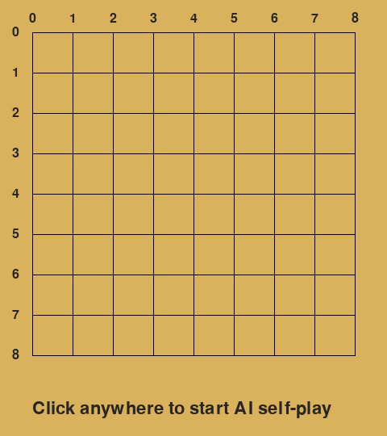

# AlphaZero Gomoku 9x9

AlphaZero-style reinforcement learning for 9x9 Gomoku, with trained checkpoints and Pygame demos.



## Setup

```bash
uv sync
```

Check the active PyTorch device:

```bash
uv run python -c "import torch; print(torch.cuda.is_available()); print(torch.cuda.get_device_name(0) if torch.cuda.is_available() else 'CPU only')"
```

Conda is also supported with `gomoku-gpu.yml` for CUDA or `gomoku-cpu.yml` for CPU-only machines.

## Watch 800/40/200 Self-Play

```bash
uv run python play_bots.py
```

`play_bots.py` loads `SUCCESS_800_40_200/model_final.pt` and plays the same AlphaZero checkpoint against itself with `800` MCTS simulations per move. The `800/40/200` checkpoint was trained with `800` simulations, `40` self-play games per iteration, and `200` training iterations.

Click the Pygame window once to start the game.

## Implementation Notes

The project implements self-play, MCTS-guided policy targets, a residual policy-value network, checkpointing, baseline evaluation, and Pygame playback for trained agents.

Training uses batched MCTS self-play so leaf evaluations across games are grouped into larger neural network calls, improving GPU utilization compared with many small single-state evaluations.

The training search includes 50% randomised open-three threat detection. This exposes the model to tactical blocking positions without forcing every self-play game down the same defensive line, addressing a self-play distribution gap in early training.

Experiment folders keep logs and checkpoints together, including the final `SUCCESS_800_40_200` model used by the playback scripts.

## Training

Training settings are constants near the top of `train.py`. To run training:

```bash
uv run python train.py
```

Checkpoints and logs are written to `output/`.
